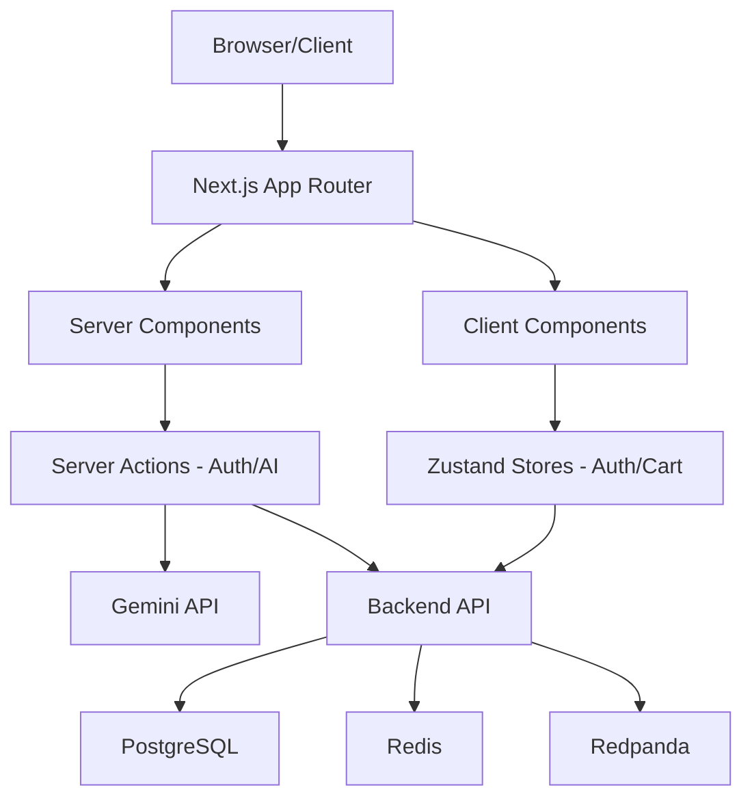

# GourmetHub — Frontend

A modern restaurant management web application built with Next.js 16, React 19, and Tailwind CSS 4. Provides a complete user experience for browsing restaurants, managing menus, placing orders, and processing payments.

---

## Table of Contents

- [Architecture Overview](#-architecture-overview)
- [Key Features](#-key-features)
- [Tech Stack](#-tech-stack)
- [Prerequisites](#-prerequisites)
- [Quick Start](#-quick-start)
- [Environment Variables](#-environment-variables)
- [Project Structure](#-project-structure)
- [Application Routes](#-application-routes)
- [Authentication Flow](#-authentication-flow)
- [State Management](#-state-management)
- [API Client Architecture](#-api-client-architecture)
- [Cart & Order Flow](#-cart--order-flow)
- [Media Upload Pipeline](#-media-upload-pipeline)
- [Design System](#-design-system)
- [License](#-license)

---

## 🏗 Architecture Overview



```
┌──────────────────────────────────────────────────────────────────────────┐
│                           Next.js Application                            │
│                                                                          │
│  ┌───────────────────┐        ┌───────────────────┐        ┌──────────┐  │
│  │  App Router Pages │◀──────▶│  Zustand Stores   │◀──────▶│ Session  │  │
│  │  (SSR & Client)   │        │   (Auth, Cart)    │        │ Storage  │  │
│  └─────────┬─────────┘        └─────────┬─────────┘        └──────────┘  │
│            │                            │                                │
│  ┌─────────▼─────────┐        ┌─────────▼─────────┐        ┌──────────┐  │
│  │  Server Actions   │        │   Fetch Client    │        │ Cloud    │  │
│  │ (Auth, Gemini AI) │        │   (Auth, Retry)   │        │ Storage  │  │
│  └─────────┬─────────┘        └─────────┬─────────┘        └──────────┘  │
└────────────┼────────────────────────────┼───────────────────────▲────────┘
             │                            │                       │
             ▼                            ▼                       │
     ┌───────────────┐            ┌───────────────┐        ┌──────┴──────┐
     │  Gemini Pro   │            │  Backend API  │        │   AWS S3    │
     │  (AI Engine)  │            │  (Go Service) │        │ (Media/CDN) │
     └───────────────┘            └───────────────┘        └─────────────┘
```

---

## ✨ Key Features

### For Customers (User Role)

- **Browse Menus** — Public, paginated menu listings with category filters, price range, and dietary tags
- **Shopping Cart** — Persistent cart (localStorage) with real-time quantity management
- **Service Charge Display** — Dynamic calculation: **10% on orders under $100, 5% on orders $100+**
- **Order Placement** — Full checkout flow with address collection and order type selection
- **Payment Integration** — Redirect to Paystack/Monnify/Flutterwave hosted payment pages
- **Order History** — Paginated order list with status badges and service charge breakdown
- **Payment Verification** — Post-payment status verification with auto-redirect

### For Restaurant Managers (Management Role)

- **Restaurant Management** — Create and configure restaurants with address geocoding
- **Menu CRUD** — Multi-step creation with name, description, recipe, images, and video
- **AI-Powered Menus** — Automated dish description generation using Gemini 2.5 Flash
- **Category Management** — AI-assisted category suggestions based on African cuisine types
- **Media Uploads** — Direct S3 presigned URL uploads for images; server-proxied multipart uploads for large videos
- **Stock Control** — Per-item stock quantities with availability toggles
- **Order Status Updates** — Transition orders through `confirmed` → `preparing` → `ready` → `completed`

### For Administrators (Admin Role)

- **User Management** — List, view, and update user roles and statuses
- **Restaurant Oversight** — View and manage all restaurant listings across the platform
- **Dashboard Analytics** — User count, restaurant count, and recent activity summaries

### Platform-Wide

- **Authentication** — Email/password with verification, Google OAuth, password reset
- **Cloudflare Turnstile** — Bot protection on all auth forms
- **Server-Side Auth** — Root layout performs SSR token refresh, seamless page loads
- **Responsive Design** — Mobile-first layout with Tailwind CSS and Radix UI primitives
- **Role-Based UI** — Dashboard adapts to `user`, `management`, and `admin` roles

---

## 🧰 Tech Stack

| Category       | Technology                                | Version   |
| -------------- | ----------------------------------------- | --------- |
| Framework      | Next.js (App Router, Turbopack)           | 16.1      |
| Runtime        | React                                     | 19.2      |
| Styling        | Tailwind CSS                              | 4.1       |
| Components     | Radix UI Themes + custom shadcn/ui        | 3.3       |
| State          | Zustand (with localStorage persist)       | 5.0       |
| Forms          | React Hook Form + Zod validation          | 7.x / 4.x |
| Charts         | Recharts                                  | 3.7       |
| Icons          | Lucide React                              | 0.563     |
| Date Utilities | date-fns                                  | 4.1       |
| Bot Protection | @marsidev/react-turnstile                 | 1.4       |
| Typography     | Playfair Display + PT Sans (Google Fonts) | —         |

---

## 📋 Prerequisites

| Dependency  | Version | Purpose                                                               |
| ----------- | ------- | --------------------------------------------------------------------- |
| Node.js     | 20+     | JavaScript runtime                                                    |
| npm         | 10+     | Package manager                                                       |
| Backend API | —       | [GourmetHub Backend](../server/README.md) running locally or remotely |

---

## 🚀 Quick Start

### 1. Install dependencies

```bash
cd client
npm install
```

### 2. Configure environment

Create a `.env` file in the `client/` directory:

```env
NEXT_PUBLIC_API_URL=http://localhost:8001/api/v1
```

### 3. Start the development server

```bash
npm run dev
```

The application will be available at **`http://localhost:8000`**.

### Available Scripts

| Command             | Description                                  |
| ------------------- | -------------------------------------------- |
| `npm run dev`       | Start dev server with Turbopack on port 8000 |
| `npm run build`     | Production build                             |
| `npm start`         | Start production server                      |
| `npm run lint`      | Run ESLint                                   |
| `npm run typecheck` | Run TypeScript type checker                  |

---

## 🔧 Environment Variables

| Variable              | Required | Default                        | Description          |
| --------------------- | -------- | ------------------------------ | -------------------- |
| `NEXT_PUBLIC_API_URL` | Yes      | `http://localhost:8001/api/v1` | Backend API base URL |

---

## 📁 Project Structure

```
client/
├── next.config.ts                   # Next.js configuration (rewrites, images)
├── tailwind.config.ts               # Tailwind CSS design tokens & theme
├── package.json                     # Dependencies and scripts
├── apphosting.yaml                  # Firebase App Hosting configuration
│
└── src/
    ├── proxy.ts                     # API proxy utility
    │
    ├── app/                         # Next.js App Router
    │   ├── layout.tsx               # Root layout (SSR auth, token refresh)
    │   ├── page.tsx                 # Landing page (hero, features)
    │   ├── globals.css              # Global styles and CSS variables
    │   │
    │   ├── actions/                 # Server Actions
    │   │   └── ai.ts                # Gemini-powered category & menu generation
    │   │
    │   ├── (auth)/                  # Auth route group
    │   │   ├── signin/              # Sign-in page
    │   │   ├── signup/              # Sign-up page
    │   │   └── forgot-password/     # Password reset request
    │   │
    │   ├── auth/callback/           # OAuth callback handler
    │   ├── verify/                  # Email verification pages
    │   ├── verify-email/            # Email verification prompt
    │   ├── reset-password/          # Password reset form
    │   │
    │   ├── dashboard/               # Protected dashboard
    │   │   ├── page.tsx             # Dashboard home (role-adaptive)
    │   │   ├── restaurants/         # Restaurant management (CRUD)
    │   │   └── users/               # User management (admin only)
    │   │
    │   ├── menus/                   # Menu browsing
    │   │   ├── page.tsx             # Menu listing (public, filterable)
    │   │   └── [id]/                # Menu item detail + edit
    │   │
    │   ├── orders/                  # Order management
    │   │   ├── page.tsx             # Order history list
    │   │   └── [id]/verify/         # Payment verification
    │   │
    │   ├── upload/                  # Media upload page
    │   ├── settings/                # User settings
    │   └── health/                  # Health check page
    │
    ├── components/
    │   ├── auth/                    # Auth forms (signin, signup, turnstile)
    │   ├── cart/                    # Cart sheet (slide-over panel)
    │   ├── forms/                   # Menu, category, restaurant forms
    │   ├── icons/                   # Custom SVG icon components
    │   ├── layout/                  # Header, Footer
    │   ├── providers/               # Auth context provider
    │   ├── restaurants/             # Restaurant cards, lists
    │   └── ui/                      # 36 shadcn/ui base components
    │
    ├── hooks/
    │   └── use-toast.ts             # Toast notification hook
    │
    └── lib/
        ├── api.ts                   # Fetch-based API client (900+ lines)
        ├── api-toast.ts             # Toast integration for API responses
        ├── actions.ts               # Server actions (signup, forgot-password)
        ├── cart-store.ts            # Zustand cart store (localStorage persist)
        ├── store.ts                 # Auth & Restaurant Zustand stores
        ├── types.ts                 # TypeScript interfaces & enums
        ├── definitions.ts           # Extended type definitions
        ├── payment-client.ts        # Multi-provider inline payment SDK
        ├── server-tokens.ts         # Server-side cookie token extraction
        ├── utils.ts                 # Utility functions (cn, etc.)
        └── placeholder-images.ts    # Placeholder image data
```

---

## 🗺 Application Routes

### Public Routes

| Path               | Component                | Description                                      |
| ------------------ | ------------------------ | ------------------------------------------------ |
| `/`                | `page.tsx`               | Landing page with hero section and feature cards |
| `/signin`          | `(auth)/signin`          | Email/password + Google OAuth sign-in            |
| `/signup`          | `(auth)/signup`          | Registration with Turnstile protection           |
| `/forgot-password` | `(auth)/forgot-password` | Password reset email request                     |
| `/reset-password`  | `reset-password/`        | Token-based password reset form                  |
| `/verify`          | `verify/`                | Email verification result page                   |
| `/verify-email`    | `verify-email/`          | Verification email prompt                        |
| `/auth/callback`   | `auth/callback/`         | OAuth provider callback processor                |
| `/menus`           | `menus/page.tsx`         | Public menu listings (filterable, paginated)     |
| `/health`          | `health/page.tsx`        | API health check status                          |

### Protected Routes (Require Authentication)

| Path                          | Roles             | Description                                  |
| ----------------------------- | ----------------- | -------------------------------------------- |
| `/dashboard`                  | All               | Role-adaptive dashboard home                 |
| `/dashboard/restaurants`      | Management, Admin | Restaurant list and management               |
| `/dashboard/restaurants/new`  | Management        | Create new restaurant form                   |
| `/dashboard/restaurants/{id}` | Management, Admin | Restaurant detail with menus                 |
| `/dashboard/users`            | Admin             | User management table                        |
| `/menus/{id}`                 | Management        | Menu item detail / edit (multi-step form)    |
| `/orders`                     | All               | Order history with status and service charge |
| `/orders/{id}/verify`         | All               | Post-payment verification                    |
| `/upload`                     | Management        | Media upload interface                       |
| `/settings`                   | All               | User profile settings                        |

---

## 🔐 Authentication Flow

### Server-Side (Root Layout)

The root `layout.tsx` performs authentication **server-side** on every page load:

```
1. Extract access_token and refresh_token from HTTP cookies
2. If access_token exists → call GET /user to validate
3. If 401 → call POST /auth/refresh with the refresh_token cookie
4. If refresh succeeds → re-call GET /user with the new token
5. If no user and route is protected → redirect to "/"
6. Pass user + token to <AuthProvider> for client-side hydration
```

### Client-Side

The `AuthProvider` component hydrates the Zustand `useAuthStore` with the server-fetched user and token. All subsequent client-side navigation uses the in-memory store for auth state.

### Token Refresh

The API client (`api.ts`) includes a `fetchClient()` wrapper with:

- Automatic `Authorization: Bearer <token>` header injection
- Token expiry check via JWT `exp` claim (client-side, not cryptographic)
- Automatic retry with refreshed token on 401 responses
- Request timeout with `AbortController` (30s default)

---

## 🗄 State Management

Three Zustand stores power the client state:

### `useAuthStore` (lib/store.ts)

| Field             | Type             | Description                |
| ----------------- | ---------------- | -------------------------- |
| `user`            | `User \| null`   | Current authenticated user |
| `accessToken`     | `string \| null` | JWT access token           |
| `isAuthenticated` | `boolean`        | Derived auth state         |

### `useRestaurantStore` (lib/store.ts)

| Field         | Type           | Description            |
| ------------- | -------------- | ---------------------- |
| `restaurants` | `Restaurant[]` | Cached restaurant list |

### `useCartStore` (lib/cart-store.ts)

Persisted to `localStorage` via Zustand's `persist` middleware.

| Field            | Type             | Description                            |
| ---------------- | ---------------- | -------------------------------------- |
| `items`          | `CartItem[]`     | Items in the cart                      |
| `restaurantId`   | `string \| null` | Locked to a single restaurant per cart |
| `restaurantName` | `string \| null` | Display name for the restaurant        |

#### Cart Business Rules

- Cart is **restaurant-scoped** — adding an item from a different restaurant prompts to clear the existing cart
- **Service charge** is calculated in real-time in the cart UI:
  - Subtotal < $100 → 10% service charge
  - Subtotal ≥ $100 → 5% service charge
- Cart total = subtotal + service charge (matches backend calculation)

---

## 🌐 API Client Architecture

The API client (`lib/api.ts`) provides a comprehensive fetch wrapper:

### Core Features

| Feature        | Implementation                                              |
| -------------- | ----------------------------------------------------------- |
| Base URL       | `NEXT_PUBLIC_API_URL` with `localhost:8001` fallback        |
| Auth           | Auto-attaches Bearer token from Zustand store               |
| Token Refresh  | Automatic 401 → refresh → retry cycle                       |
| Timeout        | 30s via `AbortController`                                   |
| Error Handling | Custom `ApiError` class with status, title, data, requestId |
| Credentials    | `include` for cookie-based auth                             |
| Retry          | Auto-retry on 401 with refreshed token                      |

### API Function Groups

| Group           | Functions                                                                                                                     |
| --------------- | ----------------------------------------------------------------------------------------------------------------------------- |
| **Auth**        | `getCurrentUser`, `refreshSession`, `signIn`, `signup`, `forgotPassword`                                                      |
| **Users**       | `getAllUsers`, `getUserById`, `updateUserRoleStatus`                                                                          |
| **Restaurants** | `getRestaurants`, `getRestaurantById`, `createRestaurant`, `updateRestaurant`                                                 |
| **Menus**       | `getMenus`, `getMenuById`, `createMenu`, `updateMenu`, `deleteMenu`                                                           |
| **Categories**  | `getCategories`, `createCategory`, `updateCategory`, `deleteCategory`                                                         |
| **Uploads**     | `getUploadUrl`, `uploadMenuMedia`, `initiateMultipartUpload`, `uploadPart`, `completeMultipartUpload`, `abortMultipartUpload` |
| **Orders**      | `createOrder`, `getOrders`, `getOrderById`                                                                                    |
| **Payments**    | `initiatePayment`, `verifyPayment`                                                                                            |

---

## 🛒 Cart & Order Flow

```
1. Browse Menus → Add items to cart → Cart auto-locks to one restaurant
2. Open Cart Sheet → Review items, quantities, service charge
3. "Proceed to Checkout" → POST /orders (items + delivery address)
4. Backend returns order with { subtotal, service_charge, total_amount }
5. Client → POST /payments/initiate → Receives authorization_url
6. Client → Redirects to provider hosted page (Paystack/Monnify/Flutterwave)
7. User completes payment → Provider redirects to /orders/{id}/verify
8. Client → GET /payments/verify?reference=... → Confirms payment status
9. Backend event: payment_successful → Order status becomes "confirmed"
```

### Service Charge Breakdown (Cart UI)

```
┌─────────────────────────────────────┐
│  Subtotal                   $85.00  │
│  Service Charge (10%)        $8.50  │
│  ─────────────────────────────────  │
│  Total                      $93.50  │
└─────────────────────────────────────┘
```

For orders ≥ $100:

```
┌─────────────────────────────────────┐
│  Subtotal                  $150.00  │
│  Service Charge (5%)         $7.50  │
│  ─────────────────────────────────  │
│  Total                     $157.50  │
└─────────────────────────────────────┘
```

---

## 📤 Media Upload Pipeline

The client supports two upload strategies:

### Small Files (< 10 MB) — Direct Upload

```
Client → GET /menus/upload-url → S3 Presigned URL
Client → PUT directly to S3 → CloudFront URL returned
```

### Large Files (Videos) — Multipart Upload

```
Client → POST /menus/multipart/initiate → { upload_id, key }
Client → POST /menus/multipart/upload-part (chunk 1, 2, 3...)
Client → POST /menus/multipart/complete → CloudFront URL returned
```

**Note**: Multipart parts are uploaded via the server proxy (`upload-part`) rather than directly to S3, avoiding browser-to-S3 CORS preflight issues.

---

## 🎨 Design System

### Typography

| Usage                       | Font             | Weight   |
| --------------------------- | ---------------- | -------- |
| Headlines (`font-headline`) | Playfair Display | 400, 700 |
| Body (`font-body`)          | PT Sans          | 400, 700 |

### Color Palette

Defined via CSS custom properties in `globals.css`:

| Token                | Usage                                  |
| -------------------- | -------------------------------------- |
| `--primary`          | Buttons, links, accent elements        |
| `--secondary`        | Section backgrounds, secondary buttons |
| `--accent`           | Headlines, important text              |
| `--muted-foreground` | Subtle text, descriptions              |
| `--destructive`      | Error states, delete actions           |

### Components

The UI is built on 36 shadcn/ui components customized via `components.json`:

- Dialog, Sheet, AlertDialog
- Table, Badge, Button
- Toast, Toaster
- Card, Input, Select
- Tabs, Separator, Skeleton
- Navigation Menu, Back Button

---

## 📄 License

This project is licensed under the MIT License — see the [LICENSE](LICENSE) file for details.
